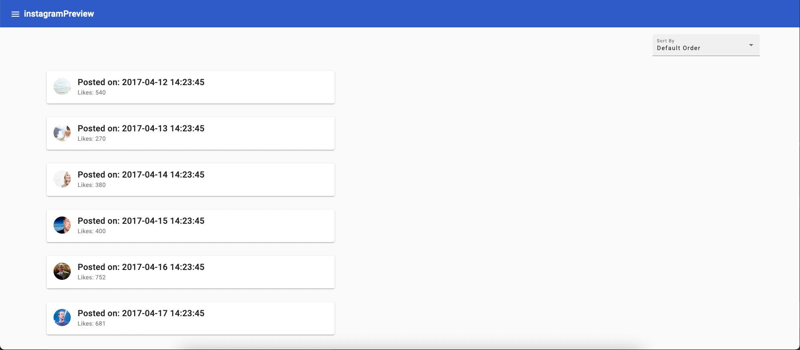
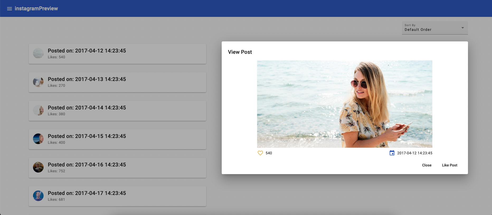
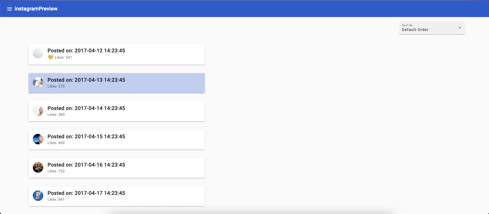
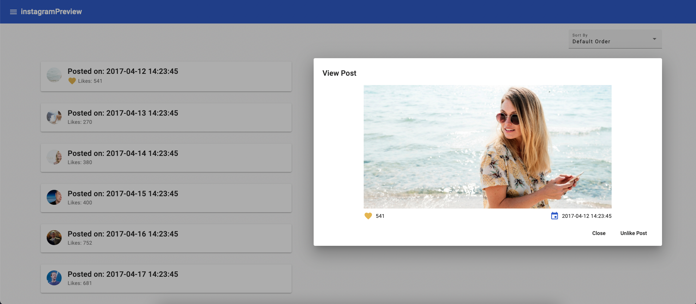
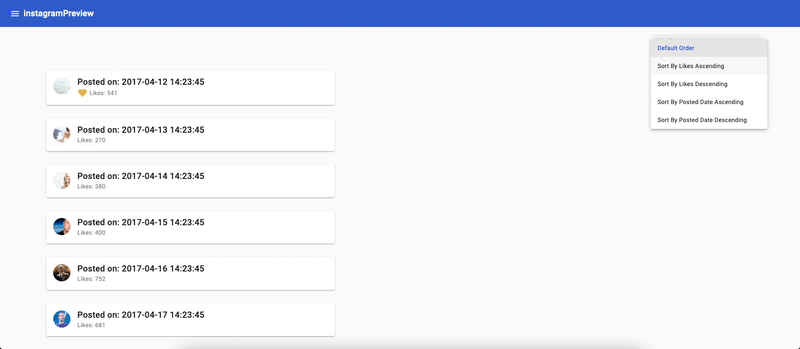
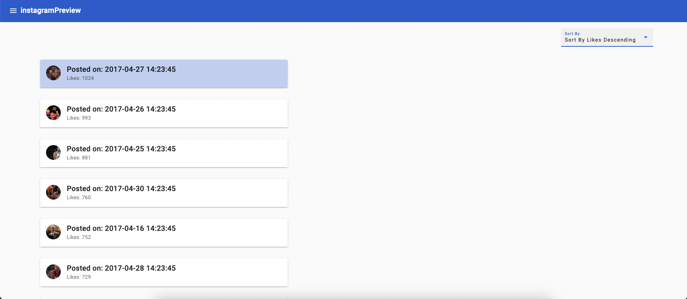

# InstagramPreview

Live demo: [Heroku App: safe-journey-89004](https://safe-journey-89004.herokuapp.com)

This project was generated with [Angular CLI](https://github.com/angular/angular-cli) version 13.3.1.

## Prerequisites
The setup assumes that git, node and npm are already installed on your machine.
###### NOTE: Please make sure you have Angular CLI installed on you machine before moving ahead with local setup.

## Local Installation Guide
clone [InstagramPreview repository](https://github.com/kunalms/instagramPreview.git)
run the command to clone the repository

`$ git clone https://github.com/kunalms/instagramPreview.git`

once the repository is successfully cloned
checkout to the root folder and run

`$ npm install`

This will make sure that all the dependencies needed for running the project are successfully resolved.

Run `ng serve` for a dev server. Navigate to `http://localhost:4200/`.
The application will spin up a development server, and you can access the application locally.

## Screenshots

#### Landing Page

Landing page lists all the post after fetching them via API

#### View Post dialog

On Click of post card A dialog opens up which has full size image of the post and allows the user to like or unlike already liked image.

#### Like Post Button

Like button enables the user to like a post and increments the like count for a given post.

#### List with liked Post

All the post which are liked by a user will have a filled heart icon in-front of like count.

#### Un-like Post Button

Un-like button enables the user to un-like a post which user has already liked and decrements the like count for a given post.

#### Sorting post options

There are four ways to sort all the post
* Sort by Likes Ascending
* Sort by Likes Descending
* Sort by Posted Date Ascending
* Sort by Posted Date Descending

#### Sorted post List

Based on user selection of sort criteria the list will update its content and render in the post in the order selected by the user.

## Development server

Run `ng serve` for a dev server. Navigate to `http://localhost:4200/`. The application will automatically reload if you change any of the source files.

## Code scaffolding

Run `ng generate component component-name` to generate a new component. You can also use `ng generate directive|pipe|service|class|guard|interface|enum|module`.

## Build

Run `ng build` to build the project. The build artifacts will be stored in the `dist/` directory.

## Running unit tests

Run `ng test` to execute the unit tests via [Karma](https://karma-runner.github.io).

## Running end-to-end tests

Run `ng e2e` to execute the end-to-end tests via a platform of your choice. To use this command, you need to first add a package that implements end-to-end testing capabilities.

## Further help

To get more help on the Angular CLI use `ng help` or go check out the [Angular CLI Overview and Command Reference](https://angular.io/cli) page.
